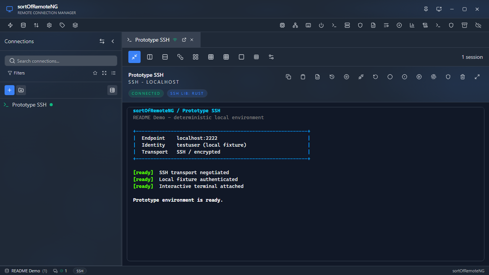

# sortOfRemoteNG

[](https://github.com/supermarsx/sortOfRemoteNG/actions/workflows/ci.yml)
[](version.json)
[](https://github.com/supermarsx/sortOfRemoteNG/releases)
[](https://github.com/supermarsx/sortOfRemoteNG)
[](license.md)

A desktop workspace for remote connections, infrastructure tools, and day-to-day administration. sortOfRemoteNG combines a Tauri and Rust backend with a Next.js and React interface, so connections and supporting tools can live in one organized application.

[](docs/assets/readme-screenshot.png)

_The real application running the seeded Prototype SSH connection._

## Contents

- [Overview](#overview)
- [What works today](#what-works-today)
- [Quick start](#quick-start)
- [Security](#security)
- [Releases](#releases)
- [Documentation](#documentation)
- [Contributing](#contributing)
- [License](#license)

## Overview

sortOfRemoteNG is built for people who manage more than one machine or service and want a single place to:

- save, group, tag, search, import, and export connection definitions;
- open remote sessions in tabs, layouts, or detached windows;
- keep connection-specific settings and credentials together;
- use diagnostics, discovery, Wake-on-LAN, recordings, scripts, and administration tools without switching applications; and
- automate session and window lifecycle events with per-connection behavior rules.

The project is under active development. Features that depend on an external service, native client, VPN provider, or host package still require that dependency to be installed and configured.

## What works today

| Area            | Current capability                                                                                                                                                                                                                   |
| --------------- | ------------------------------------------------------------------------------------------------------------------------------------------------------------------------------------------------------------------------------------ |
| Remote sessions | Embedded SSH, RDP, ARD, PowerShell Remoting, Telnet, Raw Socket, RLogin, Serial, HTTP/HTTPS, MySQL, PostgreSQL, and SMB clients; constrained VNC; installed-client handoffs for AnyDesk, RustDesk, SPICE, X2Go, NoMachine, and XDMCP |
| Files           | Native SFTP, passive FTP/FTPS, and SCP sessions with saved authentication, directory browsing, and direct file operations                                                                                                            |
| Workspace       | Collections, folders, tags, favorites, tab groups, tiled layouts, detached windows, and connection search                                                                                                                            |
| Portability     | Guided import, export, and connection cloning workflows, including mRemoteNG-oriented migration support                                                                                                                              |
| Operations      | Network discovery, connection diagnostics, Wake-on-LAN, status checks, SSH utilities, and Windows management panels                                                                                                                  |
| Automation      | Saved scripts, macros, recordings, reconnect policies, notifications, and connection behavior rules                                                                                                                                  |
| Extensibility   | Integration panels, optional AI providers, and an opt-in local REST API for controlled automation                                                                                                                                    |

### Capability boundaries

The saved-session matrix is source-backed and tested, but “supported” still has a precise meaning:

- **Raw Socket**, **RLogin**, **PowerShell Remoting**, **ARD**, **Telnet**, and **Serial** now have dedicated interactive clients. Raw Socket supplies exact binary TCP/UDP payload I/O rather than a shell; Telnet and RLogin are plaintext; and Serial depends on a local device, its driver, and operating-system permissions.
- **ARD / Apple Screen Sharing** supports a portable profile: macOS can hand Apple Account authentication to Screen Sharing.app, while Windows and Linux use an explicitly configured embedded remote-Mac-account or dedicated-VNC fallback for the same saved host. The fallback makes the connection cross-platform; it does not replay an Apple password or token. Embedded ARD is direct TCP only, and a missing or unreachable fallback fails closed. See the [Apple Screen Sharing and portable ARD guide](docs/apple-screen-sharing.md).
- **FTP/FTPS**, **SFTP**, **SCP**, **MySQL/MariaDB**, and **SMB** connect from saved settings before their file or query surfaces load. FTP and SCP currently support direct targets only; the current MySQL backend is process-wide, so independent concurrent MySQL tabs are not yet isolated.
- **PostgreSQL** opens an isolated native query session with catalog browsing, SQL query/statement results, explicit SSL modes, CA and mutual-TLS certificate paths, and deterministic disconnect. It currently supports direct targets only and rejects configured proxy, VPN, SSH-hop, or tunnel-chain routes before credentials are sent.
- **VNC** requires a WebSocket-capable endpoint or trusted WebSocket proxy because the app does not provide a raw-TCP RFB bridge.
- **AnyDesk** and **RustDesk** are installed-client handoffs. AnyDesk tracks only a launcher process it starts; its native URL fallback is untracked, and remote authentication and framebuffer state stay in AnyDesk. RustDesk verifies its backend-launched process before reporting a successful handoff. The app does not embed either product's framebuffer.
- **SPICE** launches the installed virt-viewer `remote-viewer` and supplies its standard connection file through stdin, so a saved ticket is not placed in process arguments or a persistent profile. The app verifies the local process only; remote authentication, pixels, and input remain in the native window.
- **X2Go** and **NX / NoMachine** launch the installed `x2goclient` or `nxplayer`. Password, key-passphrase, host-trust, and MFA prompts stay in the native client, and a running local process is not reported as confirmed remote authentication.
- **XDMCP** launches an installed local X server such as VcXsrv, Xephyr, or Xming. XDMCP is unauthenticated and unencrypted, so every saved connection requires an explicit risk acknowledgement and should be used only on a trusted isolated network. A running X server does not prove that a remote login screen is usable.
- These four native-display handoffs reject unsupported app proxy, VPN, SSH-hop, and tunnel-chain settings instead of silently bypassing them. SPICE supports only its dedicated credential-free HTTP CONNECT proxy field.
- **FTP/FTPS** supports passive PASV/EPSV sessions; active mode, routes, queue execution, resume, and live progress are not exposed. **SCP** enforces its host-key policy and known_hosts path, while routes, interactive host-key prompts, cancellation/progress, resume, and agent authentication remain unavailable. Both fail closed for configured proxy/VPN/tunnel routes.
- Automated tests verify application contracts and local simulated transports. A real connection still requires a reachable target, valid credentials, and any applicable native client, driver, or server configuration.
- An entry in an import format, backend crate, or settings screen does not by itself prove a complete session path. The maintained [protocol matrix](docs/protocols.md) is the authority.

These boundaries are intentional: this page describes usable application paths, not every protocol or experimental module present in the source tree.

## Quick start

### Install a published release

Published installers and application bundles appear on [GitHub Releases](https://github.com/supermarsx/sortOfRemoteNG/releases). If a bundle is available for your platform, download it, launch the application, and create or import your first connection. If no bundle has been published for the current source version, use the source workflow below.

Public bundles can be published without operating-system signing certificates. Windows SmartScreen or macOS Gatekeeper may therefore show an unknown-publisher warning on first launch. Automatic in-app updates are a separate, cryptographically signed channel: updater artifacts and `latest.json` are published only when the protected Tauri updater key is configured.

### Run from source

You need Node.js 18 or newer, the Rust toolchain pinned by [rust-toolchain.toml](rust-toolchain.toml), and your platform's Tauri build dependencies. Node.js 20 LTS is recommended because it matches CI. Windows builds require the MSVC host toolchain.

```bash
git clone https://github.com/supermarsx/sortOfRemoteNG.git
cd sortOfRemoteNG
npm install
npm run tauri:dev
```

Build an installer or application bundle for the current platform with:

```bash
npm run tauri:build
```

Build output is written under `src-tauri/target/release/bundle/`. See the [contributing guide](contributing.md) for platform packages, the Windows MSVC setup, tests, linting, and the Rust workspace commands.

## Security

sortOfRemoteNG handles credentials and privileged remote operations, so its security controls and current limitations should both be explicit:

- connection storage supports authenticated encryption at rest and refuses a plaintext downgrade after encrypted production state is installed, but application settings can remain in plaintext until encryption is initialized and unlocked;
- password-based unlock uses Argon2id, while supported systems can use the OS credential vault;
- TLS certificate and hostname verification are enabled by default, but users can override trust verification globally or per connection, and warning/acceptance UX is not universal;
- privileged work crosses a validated Tauri IPC boundary into Rust;
- the REST API is off by default and binds to loopback unless remote access is deliberately enabled; and
- application updates require a valid Ed25519/minisign signature from the key pinned in the app.

Read the [security policy](security.md) for vulnerability reporting and the [encryption design](docs/security.md) for the at-rest threat model. Never publish credentials, private keys, tokens, or unredacted logs in an issue.

## Releases

Public releases use the rolling `YY.N` format:

- `YY` is the two-digit UTC release year.
- `N` is that UTC year's monotonically increasing release sequence, starting again at 1 each January.
- The first release in the current sequence is **26.1**; tags use that bare identity with no prefix.

Every successful push to `main` queues an automatic release after the CI-internal jobs and the exact-source `Audit`, `Backend Coverage`, `Frontend Build`, and `Docker e2e (nightly)` gates pass. The release snapshot records that source commit, and rerunning recovery for the same commit reuses its tag and GitHub Release instead of consuming another sequence number.

Package managers and native manifests use the machine-readable SemVer projection `26.1.0`, while the application, bare tag, and release title show `26.1`. The rolling allocator selects the public identity; [version.json](version.json) is synchronized in the release snapshot and CI verifies every generated projection.

The release workflow builds Windows x64, Linux x64, macOS Intel, and macOS Apple Silicon bundles. OS signing certificates are optional; the Tauri updater private key is required only for signed updater artifacts and `latest.json`. See the [release guide](docs/releases.md) for publication and recovery details and the [updater setup](docs/release/updater-setup.md) for signature and feed requirements.

## Documentation

- [Documentation home](docs/index.md) and [getting started](docs/getting-started.md)
- [Connections and editor](docs/connections-editor.md), [protocol status](docs/protocols.md), [Apple Screen Sharing and portable ARD](docs/apple-screen-sharing.md), [network paths](docs/network-paths.md), [behaviors](docs/behaviors.md), and [import, export, and clone](docs/import-export-clone.md)
- [Architecture](docs/architecture.md), [security](docs/security-overview.md), [testing](docs/testing.md), [releases](docs/releases.md), and [contributing](docs/contributing.md)
- [Vulnerability reporting policy](security.md), [encryption-at-rest design](docs/security.md), and [license](license.md)

## Contributing

Issues, focused fixes, tests, documentation improvements, and well-scoped features are welcome. Before opening a pull request, run the checks that apply to your change:

```bash
npm test
npm run lint
npm run format
```

The required Docker-backed SSH/SFTP smoke commands and Rust workspace checks are documented in [contributing.md](contributing.md). Report security issues through the private process in [security.md](security.md), not through a public issue.

## License

sortOfRemoteNG is available under the [MIT License](license.md).
